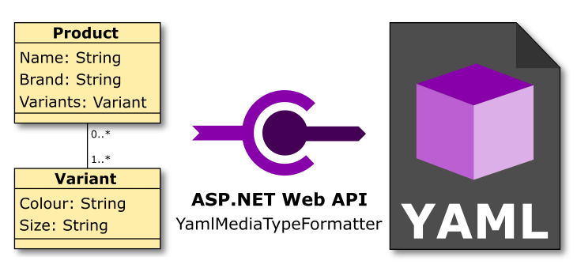

## Web API YAML MediaTypeFormatter

### Installation
The MediaTypeFormatter has been compiled against the .NET Framework v4.0 to provide compatibility across a range of recent ASP.NET Web API releases. Developers can import it into your project either via NuGet or direcctly, instructions are included for both below.

#### NuGet Method
The MediaTypeFormatter NuGet package uses David Ebbo's excellent WebActivator extension to inject startup behavior into your web application.  This means other than installing the package you don't have do any additional work.

##### UI
The following instructions apply to Visual Studio 2012+ it probably works for other versions of Visual Studio as long as you have the appropriate NuGet Package Manager extension and .NET Framework v4.0.

 1. Right Click on your Project, and select "Manage NuGet Packages...".
 2. Ensure "nuget.org" is selected in the Package Source drop down.
 3. Search for "YamlMediaTypeFormatter" and press <Enter>.
 4. Depending on your configuration you may be asked to preview your changes, specifically you will be asked if you want to install YamlDotNet, WebActivatorEx and YamlMediaTypeFormatter.

##### Command Line

The following instructions apply to Visual Studio 2012+ it probably works for other versions of Visual Studio as long as you have the appropriate NuGet Package Manager extension and .NET Framework v4.0.

 1. From the Visual Studio Menu Bar, Select "Tools".
 2. Select "NuGet Package Manager", then "Package Manager Console".
 3. Ensure "nuget.org" is selected in the Package Source drop down.
 4. Enter the following command in the console, replacing [YourProjectName] with the name of the project you wish to install the package:

    PM> Install-Package Amido.Net.Http.Formatting.YamlMediaTypeFormatter -ProjectName [YourProjectName]

#### Manual Method

If you do not want, or for some reason can not use NuGet or WebActivator then it is perfectly possible to install and use YamlMediaTypeFormatter without either.

 1. Obtain the solution source code, by cloning the Git repository into an appropiate location, such as C:\Source:

    git clone https://github.com/amido/YamlMediaTypeFormatter.git

 2. Update submodules from within the YamlMediaTypeFormatter folder:

    git submodule update --init --recursive

 
